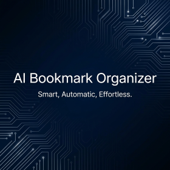

# AI Bookmark Organizer (Chrome Extension)



Organize your messy bookmarks automatically using Google Gemini AI. Privacy-focused, local processing, and instant export.

## 🚀 Features
- **One-Click Logic**: Sorts hundreds of bookmarks into smart categories (Dev, News, Shopping, etc.).
- **Privacy First**: Your bookmarks are processed in-memory and never stored on our servers.
- **Export Ready**: Save your cleaned-up bookmarks as standard HTML.

## 📥 Installation

You can install this extension manually (no Store required) by downloading the latest release.

### Method 1: Download & Install (Easiest)
1.  **Download**: Go to the `releases/` folder above and download **[bookmark_organizer_v1.0.1.zip](releases/bookmark_organizer_v1.0.1.zip)**.
2.  **Unzip**: Extract the zip file to a folder on your computer.
3.  **Open Chrome Extensions**:
    - Type `chrome://extensions` in your address bar.
    - Enable **Developer mode** (top right switch).
4.  **Load**:
    - Click **Load unpacked**.
    - Select the folder inside the unzipped location (it should contain `manifest.json`).
5.  **Done!** The extension icon should appear in your toolbar.

### Method 2: Build from Source
If you are a developer and want to modify the code:
```bash
git clone https://github.com/your-username/Bookmark-Organizer-Browser-Extension.git
cd chrome_extension/frontend
npm install
npm run build
# Then load the 'dist' folder in chrome://extensions
```

## 🔒 Privacy
We do not collect data. Your API key is stored locally in your browser. Bookmarks are sent directly to the OpenRouter API for categorization and then immediately discarded.
[Read our Privacy Policy](docs/privacy.html)

## License
MIT License
